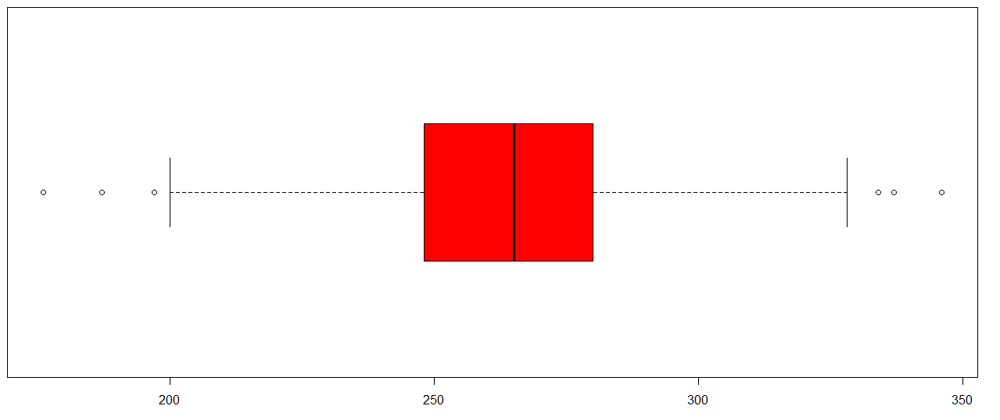
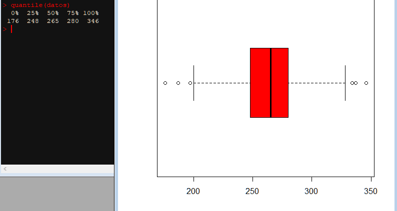
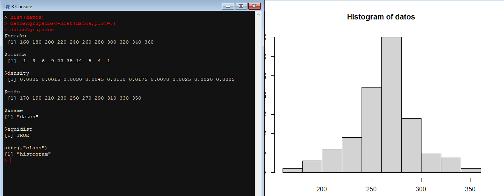
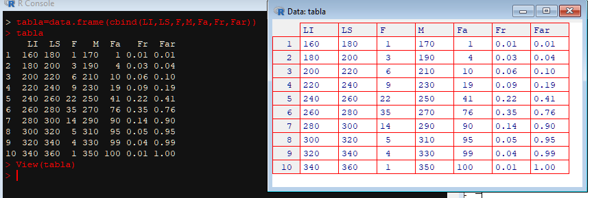
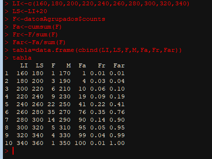
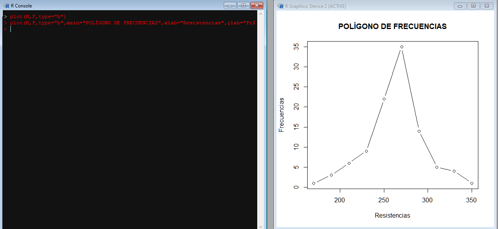
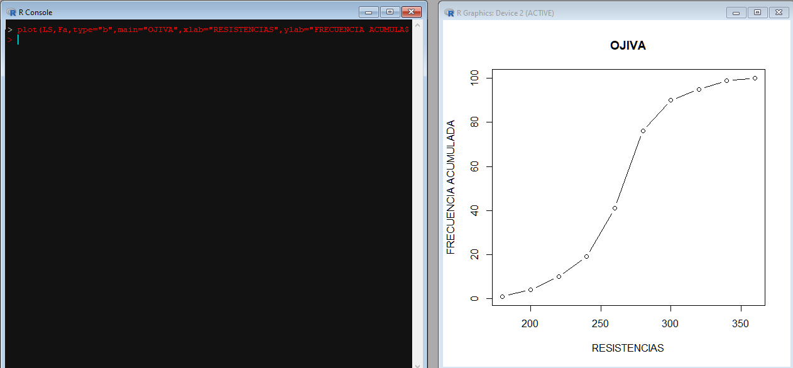

<h2>Histograma</h2>

  Es la representación gráfica de la tabla de frecuencias consiste de rectángulos que son extendidos vertitcalmente hasta el valor de frecuencia a que pertenecen, y es para 
  variables cuantitativas y datos agrupados, por lo cual van a existir intervalor y es por esta la razón por la cual se deberá de tener los rectángulos deberán estar uno tras
  otro, puesto que hay continuidad y se interpretan como intervalos.
  
  La función para hacer un histograma en R será: hist()

   
    
  De este modo tan simple se obtiene el histograma. De igual modo se permite más parámetros para poder agregar y personalizar dicho histograma.
  <ul>
  <li>xlab</li>
  <li>ylab</li>
  <li>main</li>
  <li>color</li>
  </ul>
  
  Nota: en esta gráfica solo va un color debido a que se tiene una sola variable, y como es continua en todo el histograma siempre se habla de la misma variable.

    

  <h2>Serie de tiempo</h2>
  

    Secuencia de observaciones sobre intervalos de tiempo separados de manera regular 
    
    Funciones a usar: plot(), abline() 

  
  Similar al diagrama de caja y bigotes habrá una límites de tolerancia, se calculan de la siguiente manera
    
  
  Iniciando con la representación gráfica, primero se usa plot el cual se tendrá que poner como parámetro aquella variable que contenga a los datos a querer representar.
    
  
  En esta gráfica se observa unas cosas:
  <ol>
    <li>No están unidos los puntos</li>
    <li>La escela es muy grande, o sea que está muy estirada la gráfica.</li>
    <li>No hay nombre en los ejes</li>
    <li>No tiene un título</li>
  </ol>
  
  La corrección o añadido de esto es por medio de los siguientes comandos
  <ol>
    <li>type="l": esto une los puntos, debe ir como parámetro de la función o comando.</li>
    <li>asp="valor": este es para ajustar la esala, puede ir de 1 a hacia arriba.</li>
    <li>xlab=""</li>
    <li>ylab=""</li>
    <li>main=""</li>
  </ol>
  
  <h3>Graficando los límites de tolerancia</h3>
    Para esto se tiene se tendrá ya que tener la media, la desviación estándar. El método para graficarlo será con el siguiente comando
  
  abline(h=media,col="color")
  
  De modo que media debe ser el valor d ela media y h es haciendo referencia a que la línea estará de forma horizontal, de la misma forma se gráfica ambos límites, tanto el
  inferior como el superior. Para poder entender estos límites se deberán de graficar también la media y así se ve que los límites de tolerancia a partir de la media.
  
    
  

  <h2>Diagrama de Caja y bigotes</h2>
  
Es un diagrama de caja y bigotes que se emplea como representación gráfica de variables cuantitativas. Su construcción se basa en un pentagrama, donde es un grupo de 5 estadísticos descriptivos que dividen el conjunto en 4 partes iguales, de modo que cada parte va a tener un valor de 25% sumando en total 100%
    
    
    Se observa entonces la necesidad de declarar los siguientes límites para la construcción del diagrama.
    
    <ul>
      <li>Mín </li>
        Es el mínimo de los datos proporcionados en la entrada.
      <li>Max </li>
        Es el dato más grande de la entrada proporcionada.
      <li>Cuartil - QN</li>
        Es la cantidad de datos que existen en las regiones de diagrama, Q1 es para el 25%, Q2 es para 50%, etc, Q3 es para 75% y Q 4 es hasta 100%, esto en intervalo obviamente, de modo que un intervalo puede ser [Q3,Q4].
      
    </ul>
  La construcción del diagrama será con base a las funciones: boxplot(), quantile().
   
  La función boxplot tiene como parámetros los siguientes datos
  <ul>
    <li>variable: Aquí va colocado la variable que contiene a los datos.</li>
      
    <li>horizontal=TRUE: Esto es para designar que el diagrama debe ir horizontal</li>
      
    <li>col=" "   Se coloca el color que se quiere tener en el diagrama.</li>
     
  </ul>
  Finalmente se obtiene lo siguiente:
    
  
  Se observa que hay valores afuera y estos se interpretan como valores atípicos.
  
  Para obtener el resumen pentanumérico es usando la función quantile(variable)
    
  

  
  <h2>Tabla de frecuencias</h2>
  En R se deberá de hacer un proceso inverso al que normalmente es realizado, entonces prmero se obtiene la tabla de frecuencias el cual se hará por medio de la función: his(parámetros).
  La función his(variable) es para graficar directamene un histograma, con tan solo poner la variable se obtienen los datos, por lo cual para poder obtener los datos con los cuales se realizó la gráfica se tendrá que hacer lo siguiente 
  
  <h3>Función hist</h3>
  Hay que tener en cuenta que la función hist está basado enla regla de sturges: amplitud = 1+3.322 log(n).
  De modo que podemos ver que al aplicar dicha regla generalmente no tendremos más de 10 intervalos de clase en nuestra tabla de frecuencias, siendo bueno para poder visualizar de mejor forma los datos.
  
  <h3>Obteniendo los datos del histograma</h3>
  Para poder obtener los datos usados para poder realizar el intervalo de frecuencias será usando la siguiente función: hist(variable, plot=F).
  El comando plot=F lo que hace es enviar los datos sin una interpretación gráfica, solo pura consola.
    
  
  *breaks: son los límites inferiores de los intervalos de clase.
  *counts: conteo de las frecuencias absolutas.
  *mids: marca de clase. 
  
  <h4>Entonces, ya con estos datos es posible definir lo necesario para poder crear la tabla</h4>
  
  * LI-límite inferior: se agregan los primer diez números dados.
  * LS-límite superior: se agregan el último número o LI+amplitud, donde la amplitud será de cuánto a cuánto se va obteniendo el siguiente número.
  * F-Frecuencias: para esto debemos acceder a $counts de la variable que tiene guardado los datos de la gráfica.
  * M-Marca de clasE: para se accede a $mids de la variable que tiene nuestros datos.
  * FA- Frecuencia Acumulada: para esto se debe de usar una función suma que vaya acumulando los valores, para esto se usa cumsum(variable), donde la variable a poner será aquella que tiene los datos de frecuencias
  * Fr-Frecuencia relativa: eso es simplemente la frecuencia de cada intervalo divido entre la frecuencia total (número de datos), entonces es: F/sum(F).
  * FRA-Frecuencia relativa acumulada: será ahora la frecuencia relativa acumulada o dividir cada intervalo de FA entre la frecuencia total: FA/sum(F) || cumsum(Fr)
  
  <h3>Usando data.frame</h3>
  Para poder visualizar ahora la tabla creada se podrá hacer uso de la función **"data.frame()"** donde se estará creando un frame, como una ventana.
  Ahora, para poder unir los datos que hemos obtenido será necesario usar: **cbind(variable1,variable2,variable3).**
  
  Finalmente se obtiene lo siguiente:
      
      
  

  <h2>Polígono de frecuencias</h2>
  El polígono de frecuencias es usada para poder realizar comparaciones de diferentes gráficas de distintas tablas de frecuencias, la comparación resulta más fácil así que andar comparando por medio de histogramas resulta más problematico. La forma de conseguir el polígono de frecuencias será uniendo las marcas de clases de cada intervalor por medio de una línea.
  
  >El comando a usar es **plot**
  
  <h3>Uso de plot</h3>
  Para poder usarlo y generar el polígono se deberá de insertar los siguientes parámetros
  
  * Marca de clase
  * Frecuencias
  * type="b" el cual hace que los puntos se unan con líneas.
  
  <h4>De forma adicional ya se puede añadir los nombres</h4>
  * main="" es para añadir el nombres a la gráfica
  * xlab="" añadir etiqueta al eje 'x'
  * ylab="" añadir etiqueta al eje 'y'
  
     
  
  <h2>Ojiva</h2>
  Es una gráfica de distribución de frecuencias acumuladas por lo cual la gráfica siempre será ascendente, por ende se debe de ver que la Ojiva es de frecuencias acumuladas, por ende una Ojiva relativa es una de frecuencias acumuladas relativas.
  Por lo cual, una vez realizado esto se deberá de unir los límites superiores de cada intervalo.
  >El comando a usar es plot
  
  <h3>Usando el comando plot</h3>
  Para poder realizar la ojiva se tendrá que usar el comando plot de modo que los parámetros a incorporar deberán ser
  *Límite superior-LS
  *Frecuencia acumulada
  *type="b" para que sean unidas por medio de una lineas.
  
  Ya finalmente se agregan los títulos de la forma que ya se conoce
     
  

