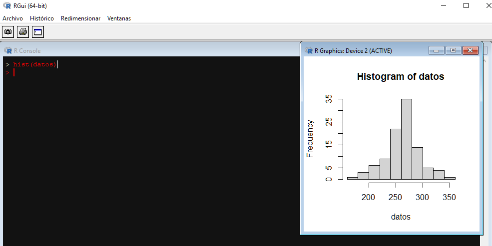

<h2>Histograma</h2>

  Es la representación gráfica de la tabla de frecuencias consiste de rectángulos que son extendidos vertitcalmente hasta el valor de frecuencia a que pertenecen, y es para 
  variables cuantitativas y datos agrupados, por lo cual van a existir intervalor y es por esta la razón por la cual se deberá de tener los rectángulos deberán estar uno tras
  otro, puesto que hay continuidad y se interpretan como intervalos.
  
  La función para hacer un histograma en R será: hist()

   
    
  De este modo tan simple se obtiene el histograma. De igual modo se permite más parámetros para poder agregar y personalizar dicho histograma.
  <ul>
  <li>xlab</li>
  <li>ylab</li>
  <li>main</li>
  <li>color</li>
  </ul>
  
  Nota: en esta gráfica solo va un color debido a que se tiene una sola variable, y como es continua en todo el histograma siempre se habla de la misma variable.

    

  <h2>Serie de tiempo</h2>
  

    Secuencia de observaciones sobre intervalos de tiempo separados de manera regular 
    
    Funciones a usar: plot(), abline() 

  
  Similar al diagrama de caja y bigotes habrá una límites de tolerancia, se calculan de la siguiente manera
    
  
  Iniciando con la representación gráfica, primero se usa plot el cual se tendrá que poner como parámetro aquella variable que contenga a los datos a querer representar.
    
  
  En esta gráfica se observa unas cosas:
  <ol>
    <li>No están unidos los puntos</li>
    <li>La escela es muy grande, o sea que está muy estirada la gráfica.</li>
    <li>No hay nombre en los ejes</li>
    <li>No tiene un título</li>
  </ol>
  
  La corrección o añadido de esto es por medio de los siguientes comandos
  <ol>
    <li>type="l": esto une los puntos, debe ir como parámetro de la función o comando.</li>
    <li>asp="valor": este es para ajustar la esala, puede ir de 1 a hacia arriba.</li>
    <li>xlab=""</li>
    <li>ylab=""</li>
    <li>main=""</li>
  </ol>
  
  <h3>Graficando los límites de tolerancia</h3>
    Para esto se tiene se tendrá ya que tener la media, la desviación estándar. El método para graficarlo será con el siguiente comando
  
  abline(h=media,col="color")
  
  De modo que media debe ser el valor d ela media y h es haciendo referencia a que la línea estará de forma horizontal, de la misma forma se gráfica ambos límites, tanto el
  inferior como el superior. Para poder entender estos límites se deberán de graficar también la media y así se ve que los límites de tolerancia a partir de la media.
  
    
  
  
  

