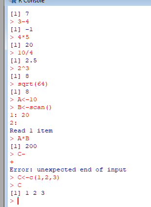

  <h1>Inicio de curso con R</h1>
  

  En 1976 se desarrolló el lenguaje S para datos estadísticos, S no era un software libre.
  Sin embargo huno un proyecto en paralelo de software libre, en R contamos con paquetes para resolver problemas estadísticos, lo cuales son una serie de programas que se distribuyen de forma gratuita por los mismo usuarios. R a su vez es también un lenguaje de programación.
  

  <h2>Comandos básicos</h2>
  
Es posible realizar diferentes operaciones, tanto las operaciones elementales como trigonométricas, distribuciones estadísticas, el funcionamiento o la forma en que se va 
    proyecta dicha información será como un notebook trabajado en Python, debido a que nosostros en una línea escribimos el código y al hacer ENTER se obtiene una respuesta a 
    lo escrito.
    <ul>
      <li>Ctrl+L: Este es para limpiar el lugar de trabajo.</li>
      <li>A+B: signo usado para la suma de dos elementos.</li>
      <li>A^B: signo usado para indicar potencia de A a la B.</li>
      <li>A/B: división de elementos.</li>
      <li>sqrt(A): raíz cuadrada de A.</li>
      <li>A*B: multiplicación de elementos.</li>
    </ul>
    

    

    Se toma en cuenta que es posible la combinación de distintas operaciones, como: A*B-C. No obstante se toma en cuenta la jerarquía de operaciones, el orden queda
    de la siguiente forma: potencia/raíz, multiplicación y división, suma y resta.
  

  <h2>Captura de datos</h2>
  
La captura de datos debe de realizarse en vectores concatenados, de modo que se tendrá asignar una variable.
    Nota: vector concatenado es denotado con una 'c' minúscula.
    <ul>
      <li><- : este es el operador asignación.</li>
      <li>A<-c(2,4,6) : se ha asignado un vector concatenado a la variable A.</li>
      <li>A<-scan(): nos permite realizar un almacenado de datos en la variable A, se dejará de guardar al enter un ENTER con una entrada vacia.</li>
    <ul>
  

        
  

    Para ver la variable solo basta escribir el nombre de la variable en la línea de código.  
    Una vez que ya se tiene vectores, variables, pues estos mismos pueden operarse como C<-A*B
  

  

  <h2>Pedir ayuda sobre comandos de R</h2>
  

    Para esto se podrá hacer de dos formas, no obstante estas dos formas nosotros ya debemos de conocer de antemano el comando, y la ayuda será que nos dirá para qué sirve, 
    la función del comando.
    Entonces, la forma en que nosotros vamos a poder consultar información sobre estos comandos será por medio de dos caminos.
    <ul>
      <li><li>
    </ul>
  
  

