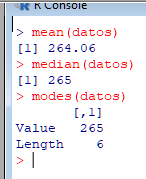
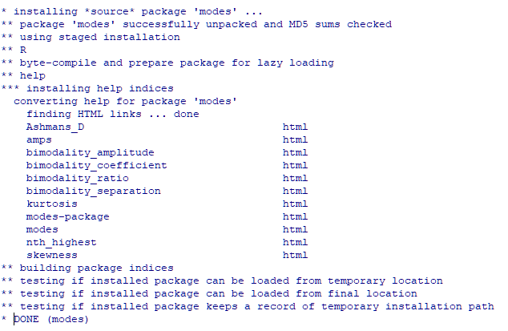
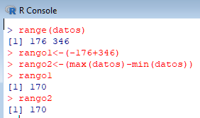
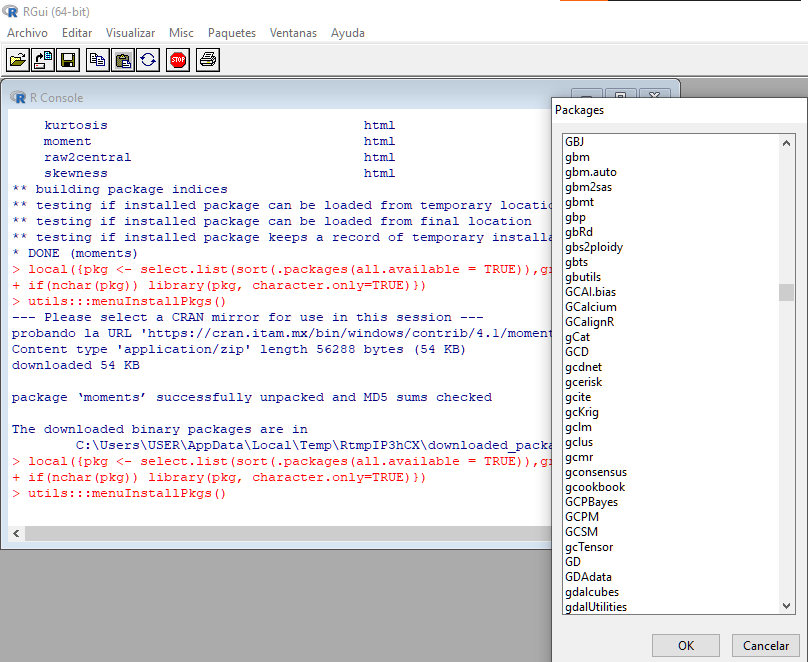
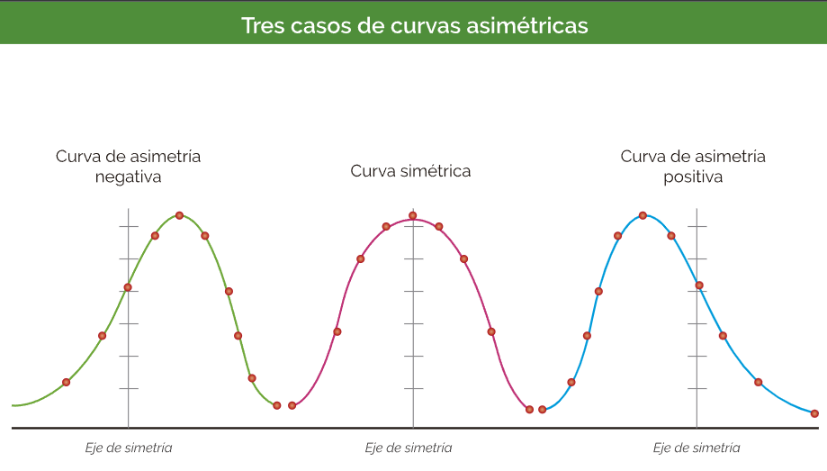
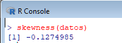
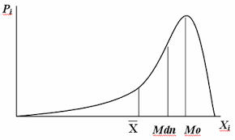
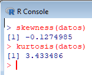

  <h1>Inicio de curso con R</h1>
  

  En 1976 se desarrolló el lenguaje S para datos estadísticos, S no era un software libre.
  Sin embargo huno un proyecto en paralelo de software libre, en R contamos con paquetes para resolver problemas estadísticos, lo cuales son una serie de programas que se distribuyen de forma gratuita por los mismo usuarios. R a su vez es también un lenguaje de programación.
  

  <h2>Comandos básicos</h2>
  
Es posible realizar diferentes operaciones, tanto las operaciones elementales como trigonométricas, distribuciones estadísticas, el funcionamiento o la forma en que se va 
    proyecta dicha información será como un notebook trabajado en Python, debido a que nosostros en una línea escribimos el código y al hacer ENTER se obtiene una respuesta a 
    lo escrito.
    <ul>
      <li>Ctrl+L: Este es para limpiar el lugar de trabajo.</li>
      <li>A+B: signo usado para la suma de dos elementos.</li>
      <li>A^B: signo usado para indicar potencia de A a la B.</li>
      <li>A/B: división de elementos.</li>
      <li>sqrt(A): raíz cuadrada de A.</li>
      <li>A*B: multiplicación de elementos.</li>
    </ul>
    

    

    Se toma en cuenta que es posible la combinación de distintas operaciones, como: A*B-C. No obstante se toma en cuenta la jerarquía de operaciones, el orden queda
    de la siguiente forma: potencia/raíz, multiplicación y división, suma y resta.
  

  <h2>Captura de datos</h2>
  
La captura de datos debe de realizarse en vectores concatenados, de modo que se tendrá asignar una variable.
    Nota: vector concatenado es denotado con una 'c' minúscula.
    <ul>
      <li><- : este es el operador asignación.</li>
      <li>A<-c(2,4,6) : se ha asignado un vector concatenado a la variable A.</li>
      <li>A<-scan(): nos permite realizar un almacenado de datos en la variable A, se dejará de guardar al enter un ENTER con una entrada vacia.</li>
    <ul>
  

        
  

    Para ver la variable solo basta escribir el nombre de la variable en la línea de código.  
    Una vez que ya se tiene vectores, variables, pues estos mismos pueden operarse como C<-A*B
  

  

  <h2>Pedir ayuda sobre comandos de R</h2>
  

    Para esto se podrá hacer de dos formas, no obstante estas dos formas nosotros ya debemos de conocer de antemano el comando, y la ayuda será que nos dirá para qué sirve, 
    la función del comando.
    Entonces, la forma en que nosotros vamos a poder consultar información sobre estos comandos será por medio de dos caminos.
    <ul>
      <li>?nombre_comando: es de esta forma que se obtiene información del comando, e.j. ?mean.</li>
      <li>help(nombre_comando): misma función, e.j help(mean)</li>
    </ul>
  
  

  <h2>MTC - Datos no agrupados</h2>
  
Algo a tener en cuenta es que estos comandos son destinados para relizar sobre datos no agrupados, en caso de querer hacerlo para datos agrupados se deberá de hacer
  pequeños programos dentro del lenguaje.

  <ul>
    <li>Media</li>
    <li>Mediana</li>
    <li>Moda</li>
  </ul>
  
  

    La aplicación de estos comandos es simplemente la siguiente:
    

    <ul>
      <li>mean(nombre_variable): la variable tendrá que tener ya los datos, por lo cual se pueden guardar con scanf.</li>
      <li>median(nombre_variable)</li>
      <li>modes(nombre_variable)</li>
    </ul>
    
  
  
  
Se debe de tener presente algo: tanto la media como la mediana ya están incorporados en el paquete default de R, no obstante para la moda es necesario descargar de 
  forma externa un paquete complementario de sitio de R, donde se descargó el programa.

  

  <h2>Cargar paquetes</h2>
  
Para poder realizar la instalación o descarga de paquetes aislado se tendrá que descargar el archivo del paquete en formato .tar, para poder cargar dicho paquete 
  se tendrá que seleccionar en la barra de menu "Paquetes" una vez dentro se escoge "Instalar paquetes desde archivos locales". Ya solo queda unibar y abrir el archivo.
  Lo siguiente es cargar el paquete en R para que funcione, para esto volvemos a "Paquetes" y escogemos "Cargar paquete" el cual nos despliega una lista en donde se busca
  el paquete que se quiera cargar.

  

  <h2>Medidas de dispersión - Datos no agrupados</h2>
  

    Serán medidas de dispersión obtenidas de variables cuantitativas, aquellas que se pueden contar, esto con el fin de realizar interpretaciones gráficas de los datos:
    <h3>Cálculo del rango:</h3>
  <dl>
      Para el cálculo del rango se debe de tener en cuenta que existen dos formas, una es realizar la resta entre el mínimo y el máximo, mientras que la segunda opción es directamente con la función, la cual nos regresa dos valores que es el mínimo y máximo. Realmente se estaría haciendo lo mismo.
      <dt>Máximo: max()</dt>
          <dd>El valor máximo que se tiene en los datos recabados, los datos están ordenados el máximo es el último número.</dd>
      <dt>Min: min()</dt>
          <dd>El valor mínimo de los datos, si están ordenados entonces es el primer número.</dd>
      <dt>Rango: range()</dt>
          <dd>Tamaño del intervalo de datos, de modo que en datos noa agrupados se distinguen fácilmente al estar los datos ordenados, tal que el mínomo es trivial, es el      primer número, el máximo será el último. </dd>
      </dl>
  
  
  <h3>Cálculo de la varianza:</h3>
  Variable estadística capaz de medir dispersión de los valores con respecto a la media.
  El valor se obtiene como s^2 por lo cual los datos están en cuadrado.
  
  <dl><dt>var()</dt><dd>La aplicación de la función es colocar la variable directamente en los paréntesis</dd></dl>
  
  
  <h3>Cálculo de la desviación estándar</h3>
  Esto es la raíz cuadrada de la desviación estándar, ayuda a medir la varianza con respecto a la media y además de un ajuste de unidades de la variable de estadística que se     trabaja.
  
  <dl><dt>sd()</dt><dd>La aplicación de la función es colocar la variable directamente en los paréntesis</dd></dl>
  <dl><dt>sqrt(var())</dt><dd>También es otra forma, combinando funciones.</dd></dl>
 
  
  <h3>Coeficiente de variación</h3>
  Es para poder comparar dispersiones de variables que están en unidades diferentes, o poblaciones desigualdades.
  En R no hay una función como tal, pero es posible hacer el cálculo de este valor por medio de una combinación de funciones
  Recordando que el coef. de variación se obtiene como un cociente de la desviación estandar entre la media, y se multiplica por 100 para el porcentaje
  
  <dl><dt> (sd()/mean())*100 [s] </dt></dl>
  
  

  <h2>Coeficiente de asimetria (a3) - Factores de forma</h2>
  
También conocido como sesgo, reflejha el grado de simetría respecto a la media, su calculo manual es a: momento central de orden 3 / desviación estandar. Por lo cual resalta la necesidad de usar el cálculo de momentos. Estos cálculos no se encuentran de forma nativa dentro de R, sino que es necesario tener que instalar y cargar dicho paquete como fue realizado anteriormente con otro paquete para obtener la moda por medio de una función dentro de R. Para este caso el paquete a instalar tiene el nombre moments_013.tar. Nota es posible la instalación de paquetes dentro de R al dar click en la sección paquetes e Instalar paquetes, se escoge un server, preferentemente del país que uno es, para depsués escoger el paquete a instalar y ya por último se carga el paquete.

  
  
El momento 3 y 4 permite calcular la simetria de curtosis.
      La simetría permite obtener la úbicación donde se encontrará el sesgo, esto partiendo de la media debido a que es a la mitad donde se define el nombre para cada valor que pueda dar el coeficiente de simetria, estos son:
    <ul>
      <li>Asimétrica con sesgo negativo a3</li>
      <li>Simétrica, a3=0</li>
      <li>Asimétrica con sesgo positivo</li>
    </ul>
  Y esto gráficamente se observa de la siguiente forma:
    
  
  Dentro de R la manera de realizar este cálculo será por medio de la función skewness(), de forma la variable va dentro de la función.

    
  En mi caso, el coeficiente de asimétria obtenida es negativa lo cual se deberá de interpretar que el sesgo será negativo, o sea que el lugar en donde se tendrá la mayor cantidad de datos será a la izquierda, mientras que el sesgo, donde la cantidad de datos es menor, será a la derecha.
     
  Esto es un aproximado, una gráfica genérica, debido a que hasta el momento lo único que se conoce es dónde esta la mayor cantidad de datos pero no sabemos la dispersión de estos, y para tal cosa será necesario calcular el coeficiente de curtosis (a4). 
  

  <h2>Coeficiente de curtosis a4 - Factor de forma</h2>
  
Eñ coeficiente de curtosis es la medida de distribución de los datos entorno a la media, de modo que será en sí la dispersión de los datos en la media, indicará si hay tendencia en los datos y qué tan concentran lo están. El criterio para designar a qué tipo de caso corresponde según el valor del coeficiente será por medio de el siguiente listado:
    <ul>
      <li>Distribución leptocúrtica a4>3</li>
      <li>Distribución mesocúrtica a4 = 3</li>
      <li>Distribución platicúrtica a4<3</li>
  </ul>
   
       
    
  Es de esta forma que conoceremos la distribución de los datos, la función para este cálculo ya viene en el paquete moments instalado en R por lo cual solo será necesario invocar dichar función: kurtosis(), sí con k...
     
    
  Finalmente se deduce entonces que nuestros datos tienen una distribución asimétrica con sesgo negativo y una distribución de los datos leptocúrtica entorno a la media.
  

<h2>Referencia de imágenes</h2>
<ul>
  <li>https://revistas.tec.ac.cr/index.php/eagronegocios/article/download/4456/4046/12439<li>
  <li>http://virtual.umng.edu.co/distancia/ecosistema/odin/odin_desktop.php?path=Li4vb3Zhcy9pbmdlbmllcmlhX2NpdmlsL3Byb2JhYmlsaWRhZF95X2VzdGFkaXN0aWNhL3VuaWRhZF8xLw==#slide_8</li>
  
  </ul>
